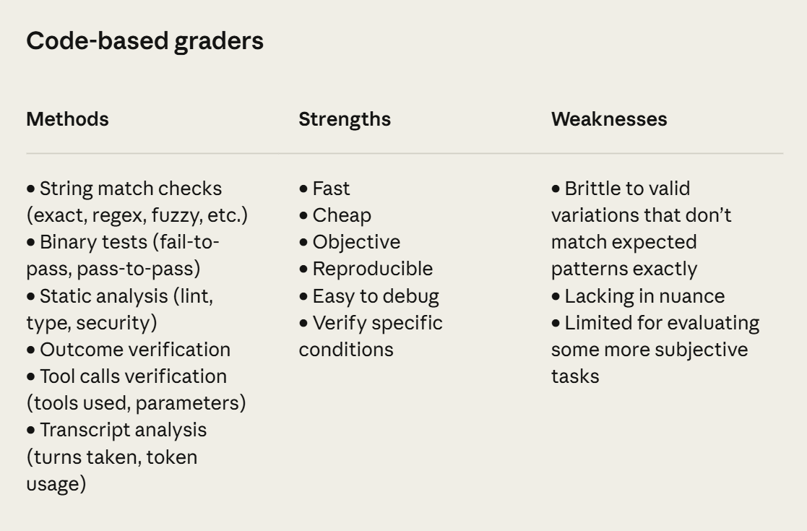
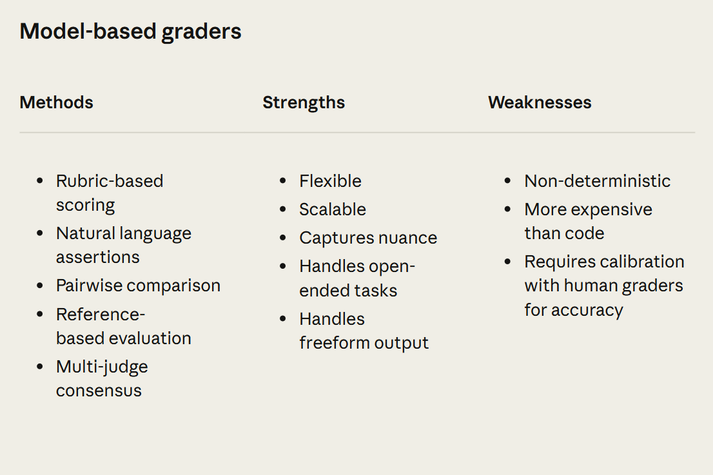
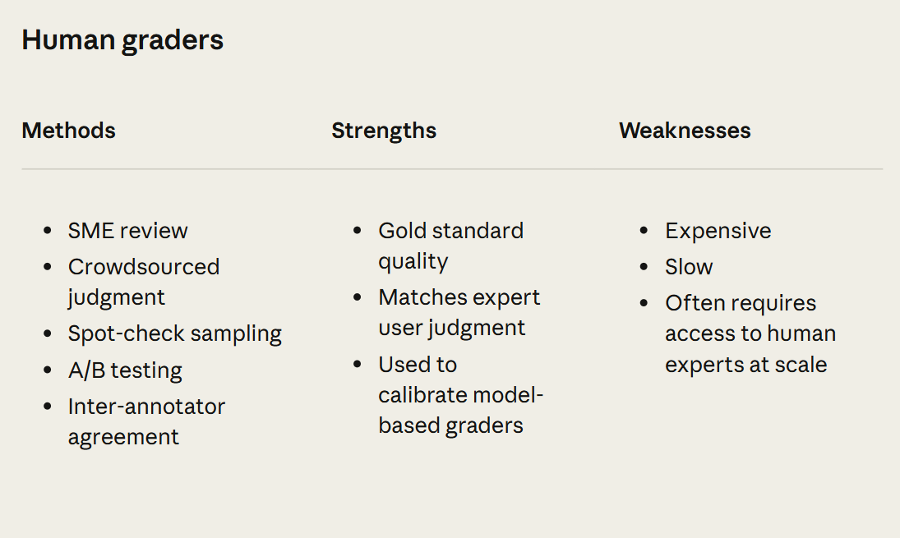
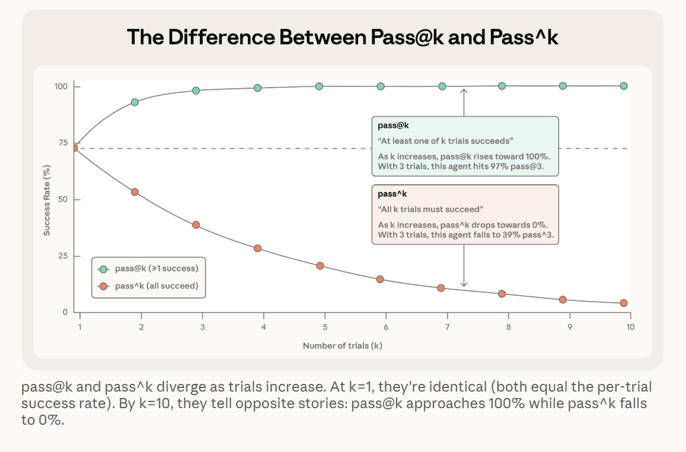
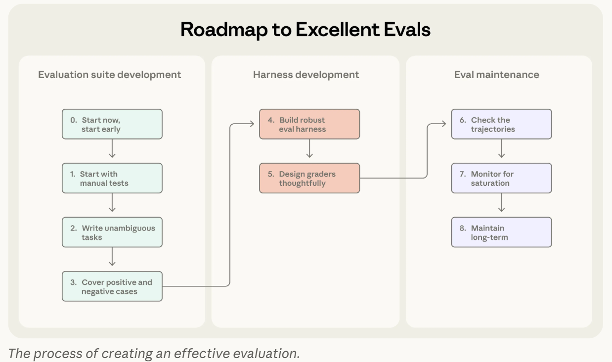
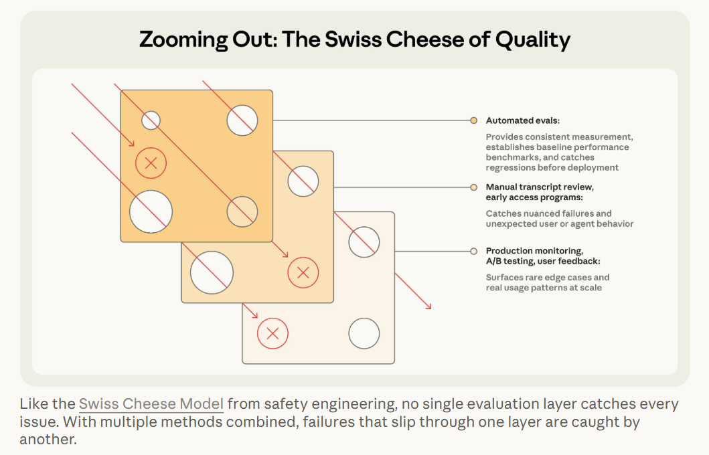

# Agent Evals Playground

This repo is a small, practical project for experimenting with agent evaluations.
The current example is a financial assistant built with LangGraph and Azure OpenAI, plus a lightweight eval pipeline for running tasks, scoring outputs, and reviewing results.

The broader point is simple: evals for agents play a role similar to unit tests for code, but they matter even more because agent behavior is probabilistic. If you do not measure performance deliberately, it is hard to tell whether a prompt change, tool update, or model swap actually improved anything.

This project was heavily inspired by Anthropic's excellent article on the topic:
[Demystifying evals for AI agents](https://www.anthropic.com/engineering/demystifying-evals-for-ai-agents)

## What This Repo Contains

- A simple financial agent wired to Azure OpenAI
- A dataset of financial QA tasks in `datasets/financial_qa.json`
- An eval runner that executes tasks against the agent
- Two scoring modes: exact match and LLM-as-judge
- A terminal report that summarizes task-level results

## Quick Start

### 1. Install dependencies

This repo uses Poetry.

```bash
poetry install
```

### 2. Configure environment variables

Copy `.env.example` to `.env` and fill in your Azure OpenAI settings.

```bash
cp .env.example .env
```

Required variables:

- `AZURE_OPENAI_API_KEY`
- `AZURE_OPENAI_ENDPOINT`
- `AZURE_OPENAI_DEPLOYMENT`

Optional:

- `AZURE_OPENAI_API_VERSION` (defaults to `2025-01-01-preview`)

### 3. Run the evals

Run the full dataset:

```bash
poetry run python run_eval.py
```

Run only tasks with selected tags:

```bash
poetry run python run_eval.py --tags calculation
poetry run python run_eval.py --tags live_data roi
```

Run a single task:

```bash
poetry run python run_eval.py --task roi_basic
```

Skip the LLM judge and only run exact scoring:

```bash
poetry run python run_eval.py --no-judge
```

## Eval Pipeline

The evaluation flow in this repo is intentionally straightforward:

1. Load tasks from the dataset
2. Build the financial agent
3. Run the agent on each task
4. Score the outputs with exact checks and, when needed, an LLM judge
5. Print a report summarizing performance

This keeps the loop short enough to iterate quickly while still reflecting the real constraints of agent development: prompts change, tools fail, model behavior shifts, and evaluation needs to keep up.

## Why Agent Evals Matter

Evals are not just for measuring quality once. They also determine how fast you can safely improve a system.

When a stronger model becomes available, teams without evals often spend weeks manually testing whether it actually helps. Teams with evals can run a repeatable suite, identify where the new model is better or worse, adjust prompts, and upgrade with much less guesswork.

There are many kinds of evals, and the right choice depends on the job your agent is supposed to do.







## Capability vs. Regression Evals

Capability evals ask: what can this agent do well today?

They usually start with a lower pass rate and focus on tasks the agent still struggles with. That makes them useful for hill-climbing. They show where the system is weak and whether recent changes are moving the boundary of what the agent can do.

Regression evals ask: does the agent still do the things it used to do reliably?

These should stay close to a 100% pass rate. If they drop, something likely regressed. As capability tasks become stable and repeatedly successful, they can graduate into regression tests and become part of the system's ongoing safety net.

## Non-Determinism and How to Measure It

Agent behavior varies from run to run. A task that passes once may fail the next time, especially when tool use, long reasoning chains, or ambiguous grading are involved. Because of that, a single run is often not enough to understand performance.

Two useful metrics are:

- `pass@k` (prounounced as pass at k): the probability that at least one of `k` attempts succeeds
- `pass^k` (pronounced as pass upto k): the probability that all `k` attempts succeed

`pass@k` is useful when one successful answer is enough. `pass^k` is more relevant when users expect reliable behavior every time.

For example, if an agent succeeds 75% of the time on a task, then the probability that it succeeds three times in a row is:

$$
0.75^3 \approx 0.42
$$

That is why consistency is often harder to achieve than a one-off success.



## Choosing the Right Grader

Good eval design also depends on choosing the right grader for the task.

- Use deterministic graders when correctness can be checked directly
- Use LLM judges when the answer space is flexible or qualitative
- Use humans selectively when the nuance is too high for automated grading alone

In this repo, both deterministic scoring and LLM-as-judge are available, which is a practical pattern for many agent systems.

## Notes Worth Keeping in Mind

One of the strongest ideas from Anthropic's write-up is that eval ownership should not be isolated to a single technical team. Core infrastructure can be centralized, but the people closest to product requirements should help define the tasks. They usually know best what success actually looks like.

That leads naturally to eval-driven development:

- define the behavior you want before the agent can do it reliably
- write tasks that expose the gap
- iterate on prompts, tools, and models
- promote stable capability tasks into regression coverage

The result is a faster and less opinion-driven development loop.



## A Useful Analogy

This analogy is worth keeping because it captures the learning loop behind evals well.


